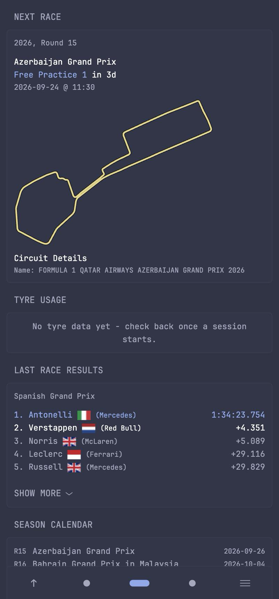

<div align="center">

# paddock-api

**F1 data, shaped for a dashboard - not a spreadsheet.**


___

<h3>

[Why This Exists](#why-this-exists) • [What It Does](#what-it-does) • [How It's Built](#how-its-built)
<br>
[Getting Started](#getting-started) • [API Reference](#api-reference) • [Development](#development) • [Demo](#demo)

</h3>

</div>

# Why This Exists
I run [Glance](https://github.com/glanceapp/glance) on a home server, and I wanted an F1 corner of it that felt like it belonged there - local time, a track map before I've even had coffee on qualifying day, team names short enough to fit a dashboard tile instead of "Mercedes-AMG Petronas Formula One Team." The community's [F1 widget](https://github.com/glanceapp/community-widgets/blob/main/widgets/formula1-widgets-by-abaza738/README.md) got the styling right, but the API behind it was built for a generic consumer, not a self-hosted dashboard: everything in UTC, no caching (so every widget refresh meant a slow round-trip), and just enough detail to be a bit unsatisfying for a Friday-night "what's happening this weekend" glance.

So this exists to be the API I actually wanted underneath those widgets - same look, an engine built for exactly one job.

# What It Does
Point it at a race weekend and it tells you what's actually useful to know: when the next session is, in your own timezone, counting down to whichever one you care about. It knows who's leading the championship and by how much, cleaned up to team names that fit a phone screen. It'll draw you the track before a single lap has been driven there. And once a session's actually happened, it'll tell you what tyres everyone was on and for how long - not the fantasy of who's got how many sets left, just what's real.

Everything is cached deliberately, not by default TTL - a session's data doesn't change until the next session starts, so that's when the cache actually expires, not some arbitrary five minutes later.

# How It's Built
It's a small FastAPI service, and the interesting decisions are mostly about *where the data comes from* and *when it's actually fetched*.

Schedules, lap data, and tyre usage come from [FastF1](https://github.com/theOehrly/Fast-F1); standings and race results come from its bundled Ergast/Jolpica mirror. Both are free, but F1's live-timing backend behind them has a real 500-calls/hour ceiling, and it's shared - burn through it chasing something that isn't there, and every other endpoint on the same network starves too. So the rule here is: only ever ask for a session that's actually happened, and never guess.

Track maps break that pattern entirely, on purpose. Tracing a circuit's outline from a car's GPS telemetry only works once a car has actually driven it - which is useless for a brand-new venue's debut weekend, and turned out to be the single most fragile part of this whole service. It's replaced now with [bacinger/f1-circuits](https://github.com/bacinger/f1-circuits), a maintained dataset of real circuit geometry that doesn't care whether a session has happened yet. No live API call, no rate limit, works for a track that's never hosted a race.

# Getting Started
Runs as a single container - `docker compose` is the easiest way in.

```yaml
version: "3.9"

services:
  paddock-api:
    container_name: paddock-api
    image: ghcr.io/drumandbytes/paddock-api:latest
    environment:
      - TIMEZONE=America/Edmonton # Specify your timezone.
      - TRACK_COLOUR=#e5d486 # Specify desired track map color
      - EVENT_DETAIL=main # Optional. main tracks qualis and races (inc. sprints), race tracks races. 
    ports:
      - 4463:4463
    restart: unless-stopped
```

| Variable | Required | Description |
|---|---|---|
| `TIMEZONE` | Yes | IANA timezone name (e.g. `America/Edmonton`, `Europe/Tallinn`) - every timestamp the API returns is converted to this. |
| `TRACK_COLOUR` | Yes | Hex colour (e.g. `#e5d486`) for the track-map line. |
| `EVENT_DETAIL` | No, defaults to `main` | Which sessions `/f1/next_race/` counts down to: `main` (quali + races, skips practice), `race` (races only), or `detailed` (every session). |

Once it's running, grab the widgets you want from [`widgets/`](./widgets/) and drop them into your Glance config - see that folder's own README for setup and what each one shows. See the [Glance docs](https://github.com/glanceapp/glance/blob/main/docs/configuration.md#including-other-config-files) for how config files like these get included.

# API Reference
Everything returns JSON except the track map, which is an SVG image.

| Endpoint | Description |
|---|---|
| `GET /f1/next_race/` | The next (or currently in-progress) race weekend - full session schedule in your `TIMEZONE`, counting down to the next session per `EVENT_DETAIL`. |
| `GET /f1/last_race/` | Full classification for the most recently completed race. |
| `GET /f1/drivers_standings/` | Drivers' championship standings, simplified team names, nationality flags. |
| `GET /f1/constructors_standings/` | Constructors' championship standings, simplified team names, nationality flags. |
| `GET /f1/next_map/` | Track map for the next race's circuit. |
| `GET /f1/tyre_usage/` | Per-driver compound and stint length for each session of the current weekend that's happened so far (FP1 through Race). Usage only, not allocation - the endpoint's own module docstring explains why. |

# Development
Requires Python 3.11+.

```sh
cd API
pip install -r requirements-dev.txt
pytest
```

`docker compose up --build` runs the whole thing locally the way it runs in production.

Three workflows keep this repo honest: [`ci.yml`](./.github/workflows/ci.yml) runs the test suite on every push and PR; [`regenerate-track-maps.yml`](./.github/workflows/regenerate-track-maps.yml) re-renders every circuit's map monthly (or on demand) and opens a PR if anything actually changed; [`release-please.yml`](./.github/workflows/release-please.yml) turns Conventional Commits into a version-bump PR, and merging it tags a release, which [`publish.yml`](./.github/workflows/publish.yml) picks up and builds/pushes to GHCR.

# Demo
<table>
<tr>
<td width="35%" align="center">
  
</td>
<td width="65%" valign="top">

Same widget styling as the community integration it's built on - the difference is everything underneath it:

- Session times in your own timezone, not UTC
- A track map, drawn before qualifying even happens - even for a circuit that's never hosted a race
- Team names simplified to fit a dashboard tile, not "Mercedes-AMG Petronas Formula One Team"
- Tyre compound and stint length per session, once a race weekend is underway
- Smart caching keyed to when the data can actually change, not a fixed TTL

</td>
</tr>
</table>

# Project Structure
```
paddock-api/
├── API/
│   ├── main.py                    # FastAPI application entry point
│   ├── requirements.txt           # Runtime dependencies
│   ├── requirements-dev.txt       # + test dependencies
│   ├── pytest.ini
│   ├── Dockerfile                 # Container build instructions
│   ├── scripts/
│   │   └── generate_track_maps.py # Pre-renders static track map SVGs
│   ├── static/track_maps/         # Pre-rendered SVGs, served directly when present
│   ├── tests/
│   └── API_Endpoints/
│       ├── constructors_cleaner.py
│       ├── current_race_cleaner.py
│       ├── drivers_cleaner.py
│       ├── last_race_cleaner.py
│       ├── tyre_usage_cleaner.py
│       ├── helpers/                # Shared schedule/time/formatting helpers
│       └── map/
│           ├── circuit_geometry.py # Static track geometry (bacinger/f1-circuits)
│           ├── map_generator.py    # Track SVG rendering
│           └── router.py           # Map endpoint logic
├── widgets/                       # Glance widget YAMLs, one folder per widget
├── docs/demo/                     # README screenshots
├── .github/
│   ├── workflows/                 # CI, track-map regeneration, release, publish, auto-merge
│   └── dependabot.yml
├── LICENSE
└── docker-compose.yaml            # Local development compose file
```

# License
MIT - see [LICENSE](./LICENSE).
